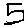

# MNIST Digit Classifier

This project demonstrates how to classify handwritten digits using a neural network trained on the MNIST dataset.

## Features
- Preprocesses images for input into the neural network.
- Trains a simple feedforward neural network using TensorFlow/Keras.
- Supports testing with custom handwritten digit images.

## Installation
1. Clone the repository:
   ```bash
   git clone https://github.com/ShouqSaadRu/mnist-digit-classifier.git
   cd mnist-digit-classifier


2. Install dependencies:
   pip install tensorflow numpy pillow matplotlib


Testing with a Handwritten Image:

I tested the model with this custom handwritten image:



The model correctly predicted the digit as 5. This shows the neural network works well with user-provided input after proper preprocessing.

How to Test Your Own Image:
Save your handwritten digit as 28x28 pixels, black digit on a white background.
Place the image in the project folder and run this code:

custom_image = preprocess_custom_image("your_image.png")
prediction = model.predict(custom_image)
print(f"Predicted digit: {np.argmax(prediction)}")
